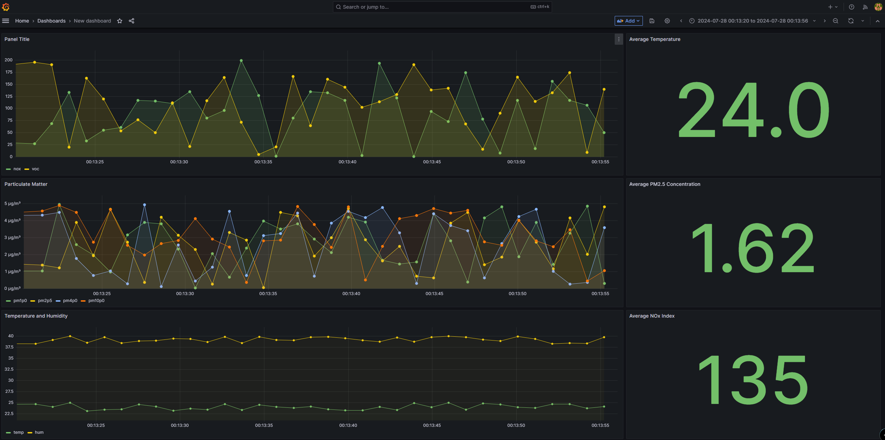
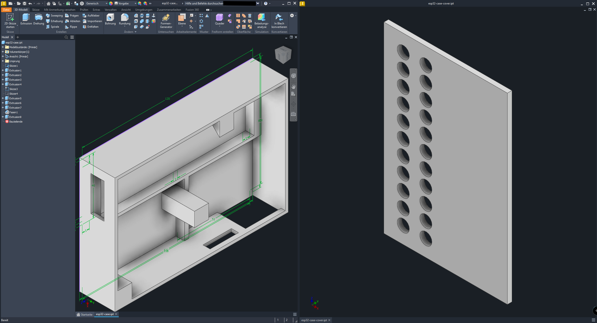

### air quality sensor
A project to measure air quality inside rooms. The following gases and attributes should be measured:
- CO2 (carbon dioxide)
- particulate matter pm1.0, pm2.5, pm4.0, pm10.0
- temperature
- humidity
- nox index

Measured data should be transmitted to a server software (will be implemented later on).
Also, focus of the project is a good documentation of the code.

### Use cases
Should be suitable for private and public use, ie public places or private rooms, maybe in classrooms later on (?!)

### Utilized parts
The solution should be rather cheap so other ppl can make use of this project without major (financial) hurdles. Cheap but good components I had laying around:
- Sensirion SEN55 sensor for particulate matter, nox, voc, temperature, humidity
- SCD41 for carbon dioxide measurements
- esp32 as the microcontroller, since many libraries are available and the platform support is very good (platformio)
- wifi for data transmission (build into esp32)

### Used libraries
- Sen55: https://github.com/Sensirion/embedded-i2c-sen5x

### Todo
- Writing documentation (how to import the database schema, grafana dashboards etc.)
- testing and bug fixing on the esp32

### Grafana dashboard 

### 3D printed case
