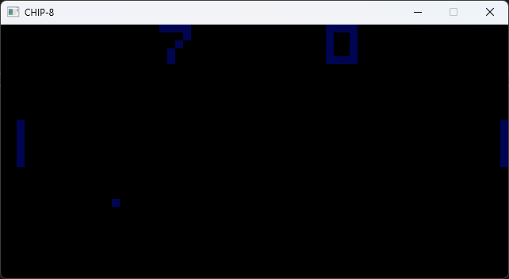
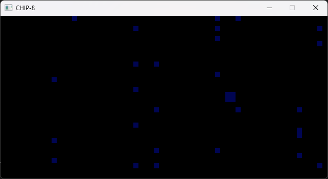

# CHIP8 Emulator
This is a simple CHIP-8 emulator written in C++. 

## What's CHIP8
CHIP-8 is a simple, interpreted programming language originally developed in the 1970s for creating video games on systems like the COSMAC VIP and Telmac 1800. Despite its age, CHIP-8 has remained popular for learning about emulation and low-level system design due to its simplicity. The term "emulator" is somewhat misleading because CHIP-8 was not a traditional hardware platform; rather, it's an interpreted language that's executed within a small virtual machine.

## Features
- Full implementation of the original CHIP-8 instruction set (no SUPER-CHIP nor XO-CHIP)
- Runs classic CHIP-8 games like space invaders, pong, snake or spaceflight
- Audio is implemented

## Impressions

## How to build
Import the project into Microsoft Visual Studio and build it. Make sure the SDL2 dependencies are installed.

## How to run
Build the project, run the executable either with the filename as the first argument or enter it manually in the mask.