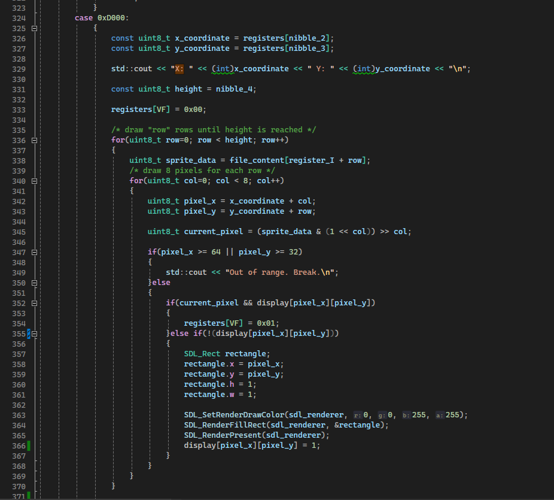
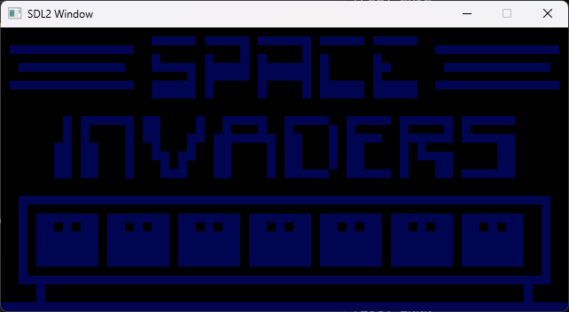

## Debugging Progress
Problem: The example ROM (just an IBM logo) looks somewhat scrambled on the screen, so there must be a parsing error somewhere


Added checks to disable out-of-bounds write (screenshot line 347)




The next problem:


### Issue is now resolved
After three hours of debugging, changing offsets, disabling the fonts etc. etc., the basic IBM logo ROM finally works now.


Multiple issues
- The entry point was set incorrectly on different spots (mitigation: global const int that manages its value)
- Font was loaded on wrong address (still doesn't work, requires further investigation)
- Main problem:
    - a huge block was being displayed but not the ibm logo
- Tried to exclude any issues coming from the SDL2 library, but I was wrong, library works fine

The old code:
```cpp
for(uint8_t col=0; col < 8; col++)
{
    uint8_t pixel_x = x_coordinate + col;
    uint8_t pixel_y = y_coordinate + row;
    uint8_t pixel_x = (x_coordinate + col) % EMULATOR_WIDTH;
    uint8_t pixel_y = (y_coordinate + row) % EMULATOR_HEIG
    uint8_t current_pixel = (sprite_data & (1 << (7 - col))) >> (7 - col);
    if(pixel_x >= 64 || pixel_y >= 32)
    {
        std::cout << "Out of range. Break.\n";
    }else
    {
        if(current_pixel && display[pixel_x][pixel_y])
        {
            registers[VF] = 0x01;
        }else if(!(display[pixel_x][pixel_y])) // <- if the pixel at coordinate pixel_x and pixel_y is black, draw the rectangle
        {
            SDL_Rect rectangle;
            rectangle.x = pixel_x * SCALE_FACTOR;
            rectangle.y = pixel_y * SCALE_FACTOR;
            rectangle.h = SCALE_FACTOR;
            rectangle.w = SCALE_FACTOR;
            rectangle.x = pixel_x;
            rectangle.y = pixel_y;
            rectangle.h = 1;
            rectangle.w =
            SDL_SetRenderDrawColor(sdl_renderer, 100, 0, 0, 0);
            SDL_RenderFillRect(sdl_renderer, &rectangle);
        	SDL_RenderPresent(sdl_renderer);
            display[pixel_x][pixel_y] = 1;
        }
    }
}    
```
So the main issue was that everytime a draw instruction was interpreted, every single bit was drawn, ignoring the fact that this should only happen to bits actually marked as to be drawn. So the else if statement is missing the clause "current_pixel &&" before checking the display pixels. Another issue was the interpretation of the stored bytes ``(sprite_data & (1 << col)) >> col`` which has to be replaced with ``(sprite_data & (1 << (7 - col))) >> (7 - col)`` since CHIP8 expectes BigEndian and not LittleEndian. Calculating these bits wrong results in a corrupted image:


### Final Code

```cpp
if (current_pixel && display[pixel_x][pixel_y])
{
    registers[VF] = 0x01;
}
else if (current_pixel && !(display[pixel_x][pixel_y]))
{
    SDL_Rect rectangle;
    rectangle.x = pixel_x * SCALE_FACTOR;
    rectangle.y = pixel_y * SCALE_FACTOR;
    rectangle.h = SCALE_FACTOR;
    rectangle.w = SCALE_FACTOR;

    SDL_SetRenderDrawColor(sdl_renderer, default_color_r, default_color_g, default_color_b, 0);
    SDL_RenderFillRect(sdl_renderer, &rectangle);
    SDL_RenderPresent(sdl_renderer);
    display[pixel_x][pixel_y] = 1;
}
```

Font error has to be fixed in the next lession.


### Debugging the flag issues


Problem to be solved first:



### New Problems

Fixed some registers but had to rollback the image drawing function, but now space invaders soo


 


 Continue to investigate the issues