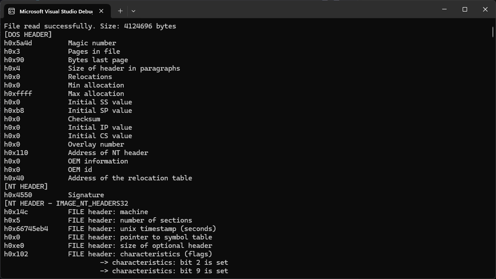

## Pe File Parser
Parser for 32bit windows PE files
### Features
This utility parses the following:
- DOS header
- NT headers (required ones)
- Optional NT headers (the ones required by windows pe loader etc.)
- Section headers and section details
- The imports:
    - DLLs
    - Function names
- Resource section (.rsrc)
    - Resolving the resource directory tree
- Basic debug information

### Resource section
- Resource section parsing is currently "beta" and has to be tested carefully

### Program overview
