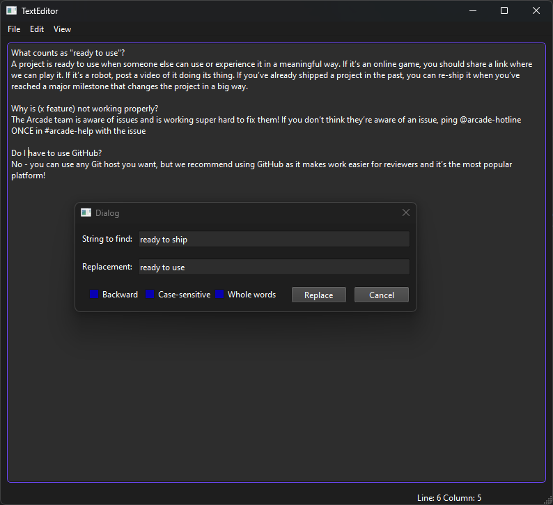

## Qt Texteditor
A simple and lightweight texteditor written in C++ using Qt 6.7.2

### Main features
- Open, edit and save files (the usual thing)
- Search:
    - case-sensitive
    - backwards
    - words
- Find and replace:
    - case-sensitive
    - backwards
    - words
- Zoom in and out
- Shortcuts / hotkeys
- todo: syntax highlighting

### How to build
- Install the Qt 6 toolkit (open source version is enough)
- Run Qt Creator, import the project
- Configure targets and installed kits
- Build the solution, run the editor

### Impressions

